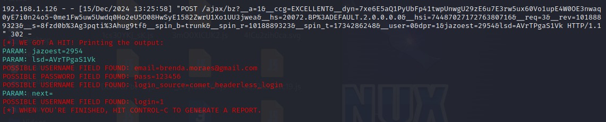
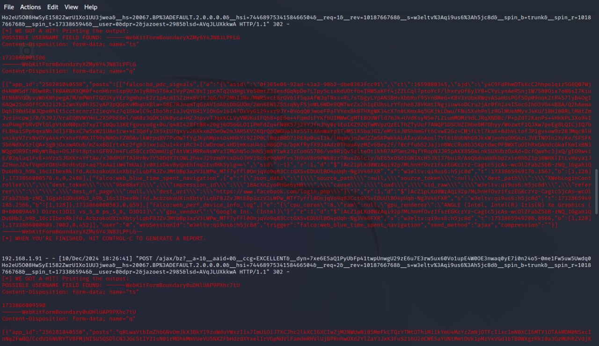

-> Introdução

Neste projeto, foi desenvolvido um exemplo 
de página de phishing que tem o objetivo de capturar
credenciais inseridas em uma página
de login simulada do Facebook.

PHISHING PARA CAPTURA DE SENHA DO FACEBOOK 

-> Ferramentas 

  * Kali Linux
  * Setoolkit

-> Configurando o Phishing no Kali Linux

  * Acesso root: sudo su
  * Iniciando o setoolkit: setoolkit: setoolkit
  * Tipo de ataque: Social-Engineering Attacks
  * Vetor de ataque: Web Site Attack Vectors
  * Método de ataque: Credential Harvester Attack Method
  * Método de ataque: Site Cloner
  * Obtendo o endereço da máquina: ifconfig
  * URL para clone: www.facebook.com

-> Resultados

 

-> Método de Defesa Facebook

 
 
